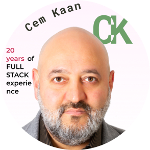

# Programlama Eğitim Yöntemim

## 20 Yıllık Deneyim

## Ne bilmek gerekiyor

* Temel bilgisayar bilgisi
* İngilizce okuduğunu anlama

## Kurs kimin için

* Bilgisayar Programlaya en baştan başlayanlar
* Python daha önce duymuş olanlar
* Nerden başlayacağına karar veremeyenler

### Dünyadaki geliştiricilerin % 70'inin ana dili ingilizce değildir

## Dilbilimsel Yaklaşımla Dil Öğrenme

Dillerin nasıl işlediğini anlamanın önemli olduğuna inanıyorum. Bu yüzden bu kursu dil eğitimi gibi organize etmek için zaman harcıyorum.

### Biçimsel ve doğal diller

Doğal diller konuştuğumuz dillerdir; Türkçe, İngilizce, İspanyolca ve Fransızca gibi. Doğal diller insanlar tarafından tasarlanmamıştır (insanlar bunlar için kurallar koymaya çalışsa bile), doğal olarak evrilmişlerdir.

Biçimsel diller insanlar tarafından özel uygulamalar için geliştirilmiş dillerdir. 
Örneğin, matematikçilerin kullandığı gösterim (notasyon), sayılar ve semboller arasındaki ilişkiyi göstermek için iyi bir biçimsel dildir. Kimyacılar, moleküllerün kimyasal yapısını göstermek için biçimsel dili kullanırlar. Ve en önemlisi:

    Programlama dilleri hesaplamaları ifade etmek için tasarlanmış biçimsel dillerdir.

Biçimsel diller sözdizimi açısından katı kurallara sahip olma eğilimindedir.

Örneğin `3+3=6` ifadesi matematiksel sözdizimsel ifadedir, ancak `3=+6$` değildir. H20 sözdizimi kimya için doğrudur, fakat `2Zz` geçerli değildir, çünkü `Zz` kısaltmasına sahip bir element yoktur.

Sözdizimsel kurallar tokenlere ve yapıya ait olmak üzere iki türdedir. Token’lar dilin temel öğeleridir; kelimeler, sayılar, parantezler, virgül, gibi. Python’da, print ("Hoşgeldin Yeni Yıl", 2013) gibi bir ifade 6 tane token vardır. Bunlar: fonksiyon ismi, açılış parentezi, cümle, virgül, sayı ve kapanış parentezi dir.

Tokenlar dizilirken hata yapılabilir. `3=+6$` ifadesiyle ilgili bir sorun, $ sembolü matematikte geçerli bir token değildir (bildiğim kadarıyla.) Benzer olarak, 2Zz ifadesi de geçerli değildir çünkü Zz kısaltmasına sahip bir element yoktur.

İkinci tür sözdizimi kuralı cümlelerin yapısıyla —tokenların nasıl dizildiği— ile ilgilidir. 3=+6$ yapısal olarak geçersizdir cünkü eşittir işaretinden hemen sonra artı işareti gelemez. Benzer olarak, molekül formüllerinde de alt işaretler element sonra gelmelidir; önce gelemezler. Bizim Python örneğimizde, eğer virgülü ihmal etseydik; veya sol ve sağ parantezlerin yerlerini değiştirseydik, print)" Hoşgelding Yeni Yıl", 2013( elde ederdik. Bu komut altı tane geçerli tokenlara sahip olmasına rağmen, bu yapı geçerli değildir.

Biçimsel bir dildeki veya Türkçe’deki bir cümleyi okuduğunuzda, cümlenin yapısını çözmek gerekir (doğal dillerde bunu bilinçiz bir şekilde yaparız.) Bu sürece ayrıştırma ( parsing) denir.

**Örneğin**, “Ayaklarıma kara sular indi” cümlesini dudyuğunuzda, “ayaklarıma”nın özne, “indi“‘nin de yüklem olduğunu anlarsınız. Cümleyi ayrıştırdığınızda, cümlenin ne anlama geldiğini ( cümlenin anlambilimini) çözersiniz. “Ayak”ın en olduğunu ve “indi” eyleminin anlamını bildiğinizi varsayarsak, bu cümleyle kastedilen anlamı ortaya çıkarabilirsiniz.

Her ne kadar biçimsel ve doğal diller birçok ortak özelliğe —tokenlar, yapı, sözdizimi, anlambilim— sahip olsa da, birçok **farklılıkları** da vardır:

**Belirsizlik**:

    Doğal diller belirsizlikle doludur, kişiler bağlamsal ipuçları ve diğer bilgilerden yararlanarak bu 
    belirsizliği aşarlar. Biçimsel diller neredeyse veya tamamen belirli olmak üzere tasarlanmıştır.
    Bunun anlamı cümlenin sadece bir anlamı vardır, bağlam ne olursa olsun.

**Fazlalık**:

    Belirsizliği önlemek ve yanlış anlamaları azaltmak için, doğal diller birçok gereksiz içeriğe sahiptir. 
    Bu yüzden birçok fazlalık barındırır. Biçimsel diller daha az belirsiz ve özdür.

**Gerçekçilik**:

    Biçimsel diller ne söylüyorsa onu kasteder. Diğer bir yandan, doğal diller deyim ve mecazlarla doludur. 
    Eğer bir kişi, ” Ayaklarıma kara sular indi.” diyorsa, bu ayaklarına kara sular indi 
    ( sanki çamurlu bir suda yürüyormuşta, ayakkabılarına kara sular doldu.) anlamına gelmez. 
    Bunun gizli bir anlamı vardır ve kişinin yorgun olduğunu belirtir. 
    Biçimsel dillerde cümlenin gerçeği aynen yansıtması gerekir, anlamı yazılanla aynı olmalıdır.

Doğal dilleri konuşarak büyüyen kişiler —herkes— biçimsel dillere alışmaktar zorlanabilirler. Bu bazı yönlerden, biçimsel dil ile doğal dil arasındaki fark, düzyazı ile şiir arasındaki fark gibidir. Ancak:

şiir:
    Kelimeler anlamları olduğu kadar sesleri için de kullanılır ve tüm şiir bir etki veya duygusal bir tepki yaratır. Belirsizlik yaygın olmasının yanında, sıklıkla bir gerekliliktir.
düzyazı:
    Kelimelerin gerçek anlamı daha önemlidir ve yapı anlama daha fazla katkı sağlar. Düzyazının çözümlenmesi şiire göre daha kolaydır ancak yine de belirsizlik içerebilir.
program:
    Bilgisayar programının anlamı belirli (tek anlamlı) ve gerçek olmalıdır; token ve yapının çözümlenmesi ile tamamen anlaşılmalıdır.

## Problem Çözerek Öğrenme

Bir dil öğrenirken o dilin kelimelerini ezberlemek yada gramer kurallarına çalışmak  yerine dili konuşmak gerekir.

İnsanlık bilgisi dille ifade edilir, bu yüzden _kodlama eğitim yöntemimi_ geliştirirken; yazılım dillerini yazılı ve sözlü bir dil perspektifinden anlamaya çalıştım.

::: info
Dersleri Takip Etmek için codewars ve kaggle hesabı açın.
:::

Kodlayarak öğreten <a href="//www.codewars.com/r/VHz6ew" target="_blank" rel="noreferrer">CodeWars Hesabı Aç</a>

Python Eğitim Platformu [Kaggle Hesabı Aç](https://www.kaggle.com/learn)

