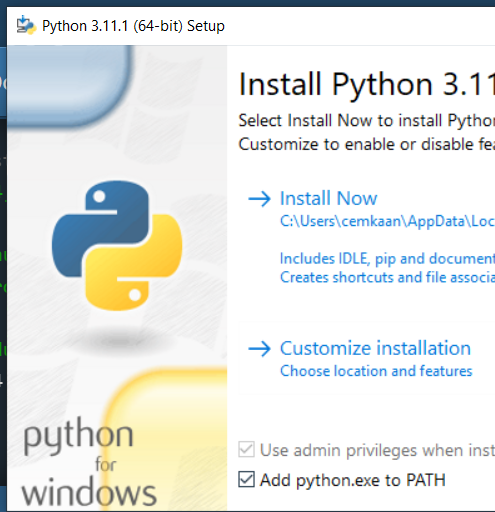

# Python Nedir?

::: info
Programcılığa başlamak için en iyi dillerden biri Python, diğeri JavaScript'dir.
:::

Fayton şeklinde okunur.

[İstatistikler](https://survey.stackoverflow.co/2022/#most-popular-technologies-language-learn)

[Python Nedir?](https://www.pythontr.com/makale/python-nedir-235)

[Python İndir](https://www.python.org/)

**Kurulum** esnasında PATH dizinine eklenecek

## Verilerin Dili

Açık kaynaklı veri araçlarının geliştiricileri ve kullanıcıları için büyük bir topluluğa sahiptir.

[Pandas](https://pandas.pydata.org/docs/getting_started/index.html#getting-started)

## Nesnelerin Dili

* [Raspberry Pi Model 3](https://www.raspberrypi.com/)
* Intel Edison
* Arduino

