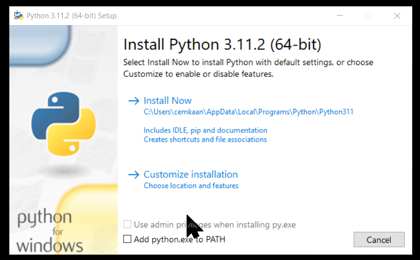

# Kullanılacak araçlar

## Python'un Kendisi

[Python İndir](https://www.python.org/)

Kurulum esnasında PATH dizinine eklenecek

## Visual Studio Code

Profesyonel bir geliştirici olarak, bir IDE (Tümleşik Geliştirme Ortamı) kullanacaksınız ve [Visual Studio Code](https://code.visualstudio.com/) benim kullandığım IDE

* Söz-dizimi Renklendirme
* Hata ve Uyarı İşaretleri
* Belgeyi Biçimlendir

**Git Desteği:** Kaynaklar Git Hub Repo'dan çevrim içi olarak çekilebilir ve bunun tersi de geçerlidir; tasarruf da yapılabilir. Kaynak çekme, kullanıma sunulan kodun klonlanması anlamına da gelir. Bu kod daha sonra değiştirilebilir ve kaydedilebilir.

**Terminal Desteği:** Çoğu zaman, kullanıcının belirli bir eylemle başlamak için dizinin kökünden başlaması gerekir, yerleşik terminal veya konsol, aynı iki ekran arasında geçiş yapmamak için kullanıcı desteği sağlar.

**Intelli-Sense:** Herhangi bir kod parçacığının eksik bırakılıp bırakılmadığını algılayabilir. Ayrıca, ortak değişken söz-dizimleri ve değişken bildirimleri otomatik olarak yapılır. Ör: Programda belirli bir değişken kullanılıyorsa ve kullanıcı bildirmeyi unuttuysa, intellisense bunu kullanıcı için bildirir.

## Python Eklentisi

<https://marketplace.visualstudio.com/items?itemName=ms-python.python>

## Faydalı Kaynaklar

::: info Hesap Açın !

Dersleri Takip Etmek için [Alıştırma Sitelerinde](../00_metot/alistirma-siteleri.md) hesap açın.
:::

[Örneklerle dolu bir kitapçık site](https://www.learnbyexample.org/python-introduction/)

[Eğitim sonunda sertifika da veren Mobil Uygulama](https://sololearn.onelink.me/MfgO/b2lvn69x)

::: tip Problem 01
Artık python nedir bildiğinize göre doğrudan bir alıştırmayla başlayalım.
[Bölüm Sonu Problemi](https://edabit.com/challenge/8ym3dKrL3svkYr4h4)
Eğer takılacak olursanız, sorunun üstündeki *Resources* sekmesinden soruda kullanılan komutlar hakkında bilgi bulabilirsiniz.
:::

::: danger Dikkat
Korkma Kodla!
:::
